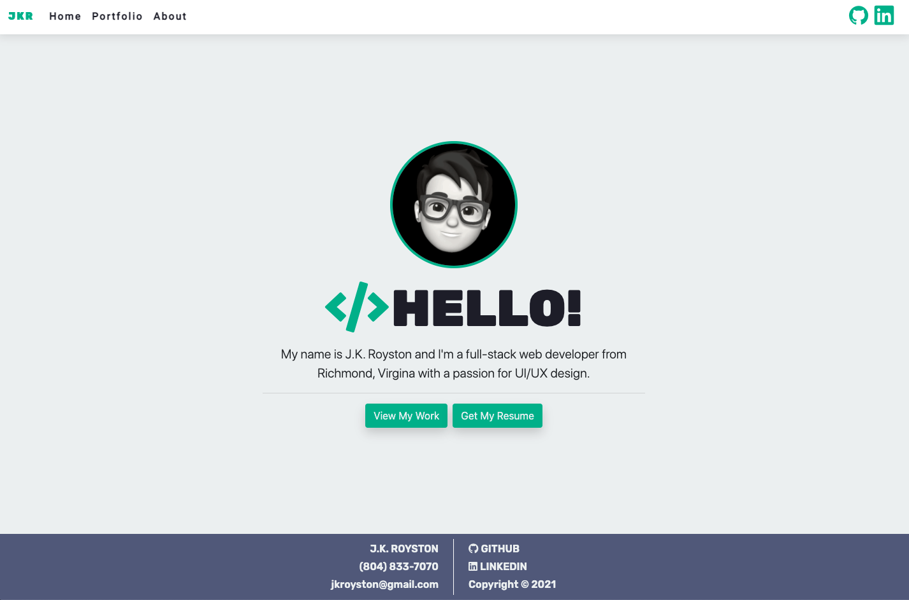
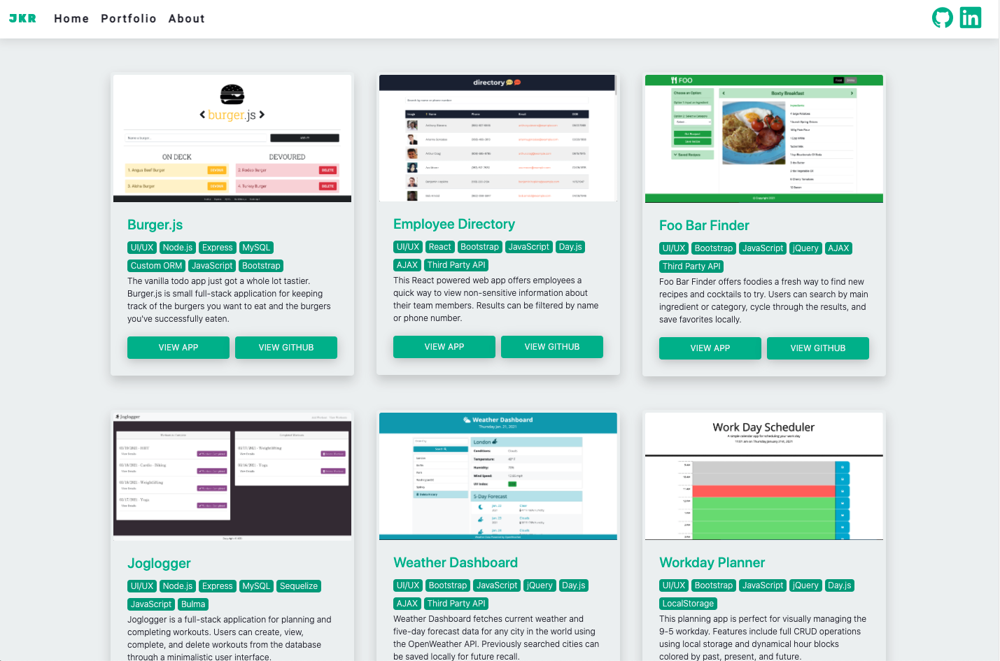
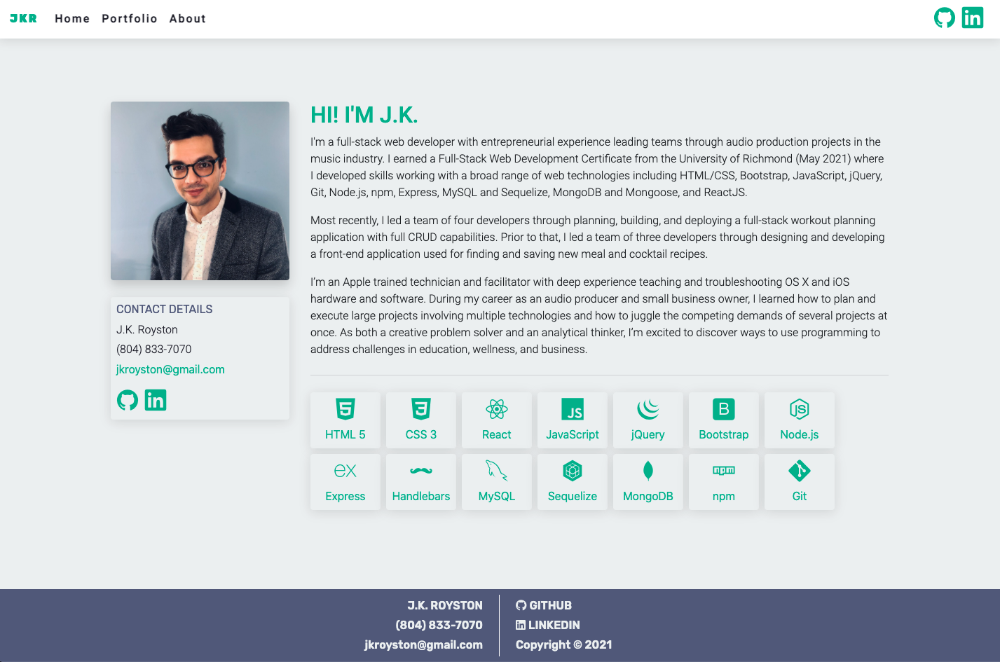

# Single Page React Portfolio

## Table of Contents
* [Deployed Application](#deployed-application)
* [Application Description](#application-description)
* [Technologies](#technologies)
* [Views](#views)
* [License](#license)
* [Contact](#contact)

## Deployed Application
The deployed portfolio can be viewed at the link below.

[Single Page Portfolio - Live Demo](https://jxhnkndl.github.io/react-portfolio)

## Application Description
A clean, responsive, React powered full-stack development portfolio with a touch of style and personality. The deployed layout showcases a fully responsive layout, a fun and simple landing page, rotating array of individual and team projects, a portfolio component featuring six front-end and full-stack projects, an extended about page including tech badges, prominent call-to-action buttons for viewing projects and downloading a current resume, detailed contact information, and a 100% unique animated avatar.

## Technologies
* React.js
* Bootstrap 4
* JavaScript
* HTML
* CSS

## Views

**Home**  
  

**Portfolio**  
  

**About**  

## License

MIT @ [J.K. Royston](https://github.com/jxhnkndl)

## Contact
J.K. Royston  
<jkroyston@gmail.com>  
[GitHub](https://www.github.com/jxhnkndl)
[LinkedIn](https://www.linkedin.com/in/johnkendallroyston/)